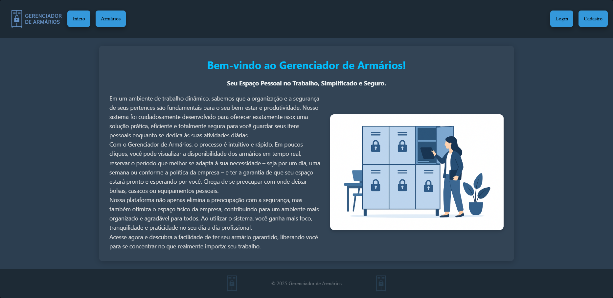
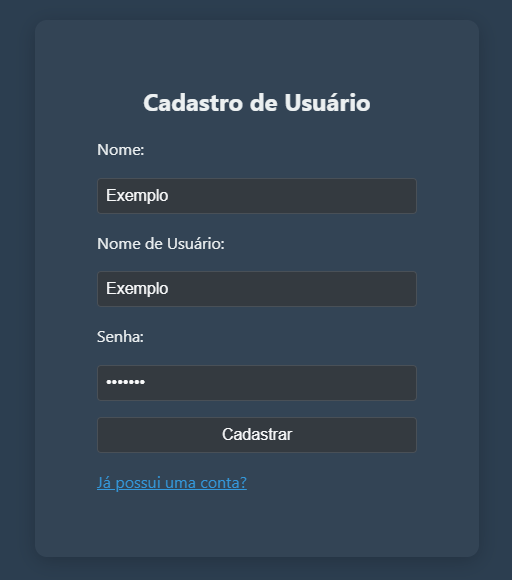
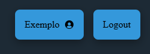
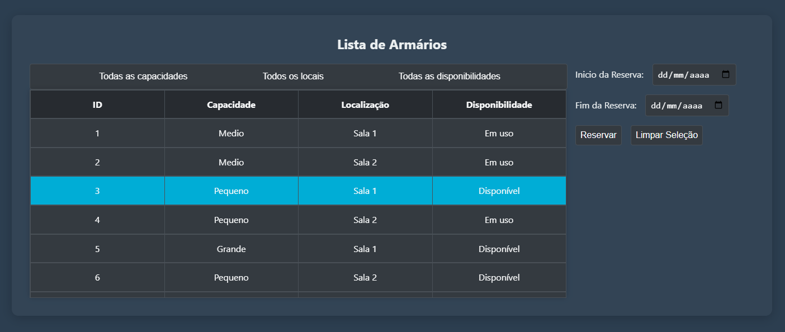
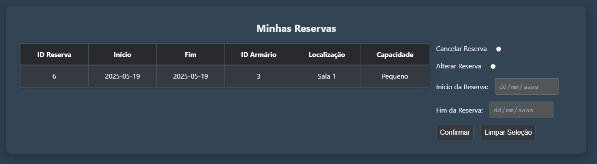
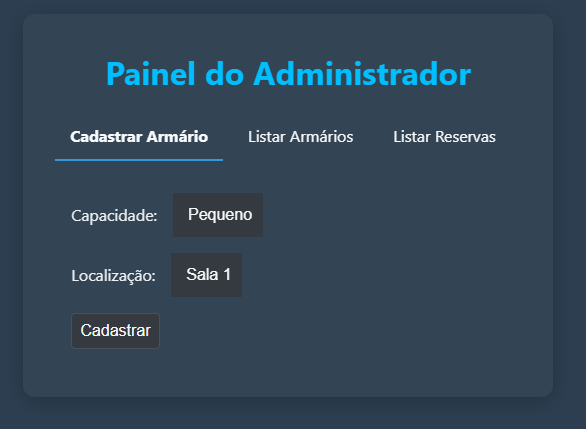
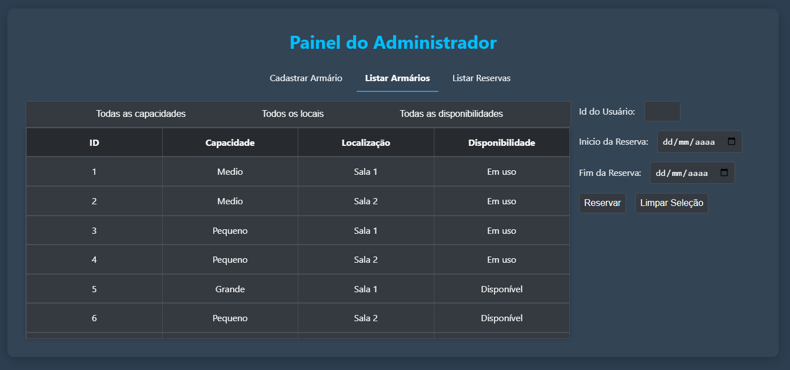
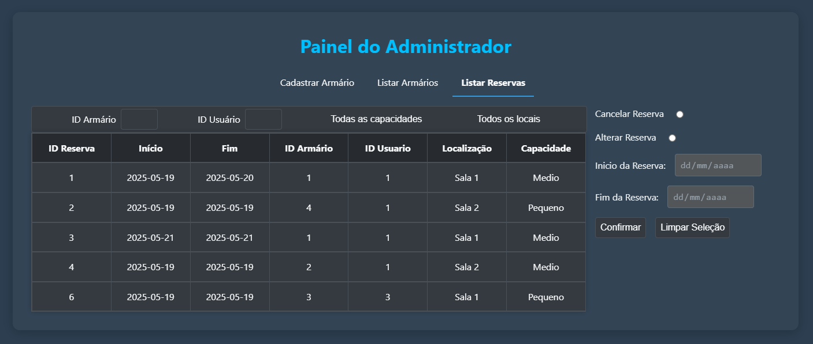
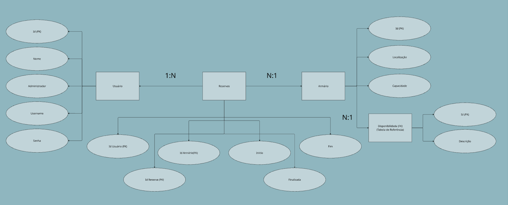

# Sistema de Gerenciamento de Armários

Este sistema foi desenvolvido para oferecer uma solução eficiente a empresas que desejam facilitar o gerenciamento dos armários disponíveis. O objetivo principal é permitir que administradores controlem o cadastro e a disponibilidade dos armários, enquanto usuários podem realizar operações como cadastro, reserva, renovação e cancelamento de maneira prática, intuitiva e segura.

As principais tecnologias utilizadas no projeto foram Python e suas bibliotecas no backend, além de HTML, CSS, JavaScript no frontend e SQLite no banco de dados.

## Instalação

### 1. Preparação do ambiente

Após clonar o repositório, vamos preparar as bibliotecas necessárias.  
É recomendado o uso de um ambiente virtual para manter as dependências isoladas. Caso prefira instalar diretamente no sistema, pode pular esta etapa.

### 2 Preparação/Configuração do ambiente Linux | Instalação de Dependências e configuração da .env
No terminal do Linux, execute o comando para criar o ambiente virtual:
```bash
$python3 -m venv ./venv
```
Ative o ambiente virtual com o Comando: 
```bash
$source ./venv/bin/activate
```
Ao ativar corretamente, o prompt do terminal exibirá o nome do ambiente (ex: (.venv)).

Instalação das dependências
Com o ambiente virtual ativado, instale as bibliotecas necessárias usando:
```bash
pip install -r requirements.txt
```
Cria uma pasta .env dentro da raiz do projeto, pode ser qualquer comando de criação de arquivo e abrir no editor da sua preferencia. Ex:
```bash
$sudo nano .env
```
Dentro do arquivo .env coloque apenas essa linha:
```bash
SECRET_KEY='sua-chave'
```
O arquivo `.env` não deve ser incluído no controle de versão para garantir a segurança da aplicação e seguir boas práticas.


### 2.1 Criar e ativar o ambiente virtual (WIndows)

No terminal do VS Code, execute o comando para criar o ambiente virtual:

```bash
python -m venv .venv
```

No Windows, a execução de scripts geralmente vem desabilitada por padrão, o que impede a ativação do ambiente virtual.  
Para liberar essa permissão, abra o PowerShell como administrador e execute:

```powershell
Set-ExecutionPolicy -ExecutionPolicy RemoteSigned -Scope CurrentUser
```

Confirme a alteração digitando `S` e pressionando Enter.

Depois, volte ao terminal do VS Code e ative o ambiente virtual com:

```powershell
.venv\Scripts\Activate.ps1
```

Se você estiver usando o Prompt de Comando (cmd), ative com:

```cmd
.venv\Scripts\activate.bat
```

Ao ativar corretamente, o prompt do terminal exibirá o nome do ambiente (ex: `(.venv)`).

### 3. Instalar as dependências

Com o ambiente virtual ativado, instale as bibliotecas necessárias usando:

```bash
pip install -r requirements.txt
```

### 4. Configurar variáveis de ambiente

Crie um arquivo chamado `.env` na raiz do projeto para armazenar variáveis sensíveis, como a chave secreta do Flask.

Dentro do arquivo `.env`, insira a seguinte linha, substituindo `'sua-chave'` por uma chave segura criada por você:

```
SECRET_KEY='sua-chave'
```

O arquivo `.env` não deve ser incluído no controle de versão para garantir a segurança da aplicação e seguir boas práticas.

### 5. Executar a aplicação

Com tudo configurado, execute o arquivo principal para rodar a aplicação:

```bash
python app.py
```

### 6. Acessar a aplicação

Quando a aplicação estiver rodando, o IP será exibido no console, como no exemplo abaixo:

    * Running on http://127.0.0.1:5000

Basta segurar `Ctrl` e clicar no link para acessar o sistema.

Caso deseje encerrar a aplicação, pressione `Ctrl+C` no terminal.


## Como usar

A seguir, estão as principais funcionalidades do sistema, com prints ilustrativas para facilitar a navegação do usuário.

### Página Inicial

A página inicial apresenta uma visão geral do sistema, com acesso rápido às funcionalidades principais. No canto superior direito, estão localizados os botões de login e cadastro, ou, quando o usuário estiver autenticado, os botões de perfil e logout.



---

### Login e Cadastro

Os usuários podem criar uma nova conta ou acessar uma já existente por meio das páginas de login e cadastro. Após a autenticação, os botões são substituídos pelo botão de perfil e a opção de logout.

  

---

### Reserva de Armários

Nesta seção, todos os armários disponíveis são listados. O usuário pode filtrar, selecionar um armário e preencher as informações necessárias para realizar a reserva.



---

### Suas Reservas

Ao clicar no botão com seu nome de usuário, o usuário é redirecionado para uma página com suas reservas ativas. É possível editar a data de término e início ou cancelar uma reserva diretamente nesta interface.



---

### Painel de Administrador

O painel do administrador oferece três áreas principais, acessadas por meio dos botões de navegação:

1. **Cadastro de Armários** – permite adicionar novos armários ao sistema.
2. **Tabela de Armários** – exibe todos os armários cadastrados, com a opção de reservar diretamente para um usuário informando seu ID.
3. **Reservas** – mostra uma lista de todas as reservas, com opções de edição de datas e cancelamento.







## Funcionalidades

- Cadastro
- Login
- Reserva
- Alteração de Reserva
- Cancelamento de Reserva
- Painel de Administrador

## Estrutura do Projeto

### Estrutura de Pastas

O projeto segue o padrão arquitetural **MVC (Model-View-Controller)**, promovendo uma separação clara de responsabilidades:

- **Model**: Responsável pela estrutura dos dados e comunicação com o banco.
- **View**: Contém os templates HTML que definem a interface com o usuário.
- **Controller**: Gerencia a lógica de negócio e o fluxo de dados entre Model e View.

#### Organização de Diretórios

```
SISTEMAARMARIO/
├── controllers/         # Controladores e rotas
├── docs/                # Arquivos de documentação
├── instance/            # Arquivo gerado do banco de dados
├── models/              # Modelos das tabelas do banco
├── static/              # Arquivos estáticos (CSS, JS, imagens)
│   ├── css/
│   ├── img/
│   └── js/
├── view/
│   └── templates/       # Templates das páginas em HTML
│       ├── Base.html
│       ├── Cadastro.html
│       ├── ListarArmarios.html
│       ├── Login.html
│       ├── PaginaInicial.html
│       ├── PainelAdmin.html
│       ├── Reservas.html
│       ├── TabelaArmarios.html
│       └── TabelaReservas.html
├── .env                 # Variáveis de ambiente
├── .gitignore           # Arquivos ignorados pelo Git
├── app.py               # Arquivo principal da aplicação
├── babel.cfg            # Configuração de internacionalização
├── config.py            # Configurações da aplicação
├── README.md            # Documentação do projeto
└── requirements.txt     # Dependências do projeto
```

Essa estrutura facilita a manutenção, organização e escalabilidade do sistema.


### Banco de Dados

O diagrama abaixo representa a estrutura relacional do sistema, com as principais entidades: **Usuário**, **Armário**, **Reserva** e **Disponibilidade**. Os relacionamentos entre essas tabelas garantem o controle das reservas e a gestão dos armários.

- Os campos `administrador` e `finalizada` são do tipo booleano e gerenciados pelo backend.
- O status das reservas e a disponibilidade dos armários são atualizados automaticamente todos os dias, facilitando as consultas e otimizando o desempenho do sistema.
- Os nomes dos campos seguem a padronização definida nos modelos do código.



## Bibliotecas Usadas

### APScheduler & Flask-APScheduler
A biblioteca facilita a automatização de tarefas na aplicação, sendo essencial para atualizar o status das reservas entre expedientes, garantindo a informação correta sobre a disponibilidade dos armários. Além disso, permite a realização de backups diários do banco de dados, protegendo a segurança e a integridade dos dados do sistema.

### Babel & Flask-Babel
Permite o uso de uma função capaz de extrair os textos marcados com a função `_()` em todo o código, facilitando que futuramente sejam implementadas novas linguagens no sistema que poderão ser alteradas facilmente entre si.

### bcrypt
Responsável pelo hashing e comparação de senhas, garantindo que sejam armazenadas no banco de dados de forma segura.

### Flask
O framework web fundamental sobre o qual toda a aplicação é construída, fornecendo as ferramentas básicas para roteamento, requisições e respostas.

### Flask-Login
Extensão do flask que gerencia a autenticação e a sessão dos usuários, permitindo implementar um sistema de login seguro e persistente.

### Flask-SQLAlchemy & SQLAlchemy
Simplificam a interação com bancos de dados relacionais, permitindo definir modelos de dados em Python e realizar operações de banco de dados de forma organizada e eficiente.

### python-dotenv
Permite carregar variáveis de ambiente a partir de um arquivo `.env` para configurar a aplicação, separando informações sensíveis do código principal.

## Requisitos

### Requisitos Funcionais

1. **Cadastro de Armários**
   **Descrição:** O administrador deve ser capaz de cadastrar novos armários no sistema.
   **Funcionalidade:** O administrador preenche um formulário com informações básicas (ex: número do armário, localização, capacidade) e o armário é adicionado ao banco de dados.
   **Requisito:** O sistema deve garantir que cada armário tenha um identificador único.

2. **Visualização de Armários**
   **Descrição:** O usuário deve ser capaz de visualizar a lista de armários disponíveis e em uso.
   **Funcionalidade:** A interface exibirá os armários cadastrados e o status atual de cada um (disponível, em uso, reservado).
   **Requisito:** O sistema deve apresentar a disponibilidade dos armários em tempo real, atualizando as informações automaticamente quando o status de um armário mudar.

3. **Reserva de Armários**
   **Descrição:** O usuário deve ser capaz de reservar um armário disponível.
   **Funcionalidade:** O usuário escolhe um armário da lista de armários disponíveis e efetua a reserva para um período determinado.
   **Requisito:** O sistema deve permitir que o armário seja marcado como "reservado" após a reserva ser feita.

4. **Renovação de Armários**
   **Descrição:** O usuário deve ser capaz de renovar a reserva de um armário para um novo período (mensal).
   **Funcionalidade:** O sistema deve permitir que o usuário clique em "renovar" em sua reserva, automaticamente renovando o período de utilização do armário.
   **Requisito:** O sistema deve verificar se o armário está disponível para renovação antes de realizar o processo.

5. **Alteração de Status de Armários**
   **Descrição:** O administrador deve ser capaz de alterar o status dos armários (disponível, em uso, reservado).
   **Funcionalidade:** O administrador pode alterar manualmente o status de um armário em caso de erro de reserva, de uso indevido ou para outras necessidades operacionais.
   **Requisito:** O sistema deve atualizar automaticamente a lista de armários assim que o status for alterado.

6. **Autenticação de Administradores**
   **Descrição:** O sistema deve permitir que os administradores façam login para acessar as funcionalidades administrativas.
   **Funcionalidade:** O administrador deve inserir um nome de usuário e senha para acessar o painel de gerenciamento dos armários.
   **Requisito:** O sistema deve garantir que somente administradores autenticados tenham acesso à funcionalidade de gerenciamento de armários.

7. **Armazenamento de Dados de Reservas e Armários**
   **Descrição:** O sistema deve armazenar de forma persistente os dados relacionados aos armários, suas reservas e status.
   **Funcionalidade:** As informações sobre o armário (número, status) e as reservas (usuário, data de reserva, data de renovação) devem ser armazenadas no banco de dados.
   **Requisito:** O banco de dados deve ser consultado e atualizado automaticamente sempre que uma reserva ou alteração de status for realizada.

8. **Interface Intuitiva e Simples**
   **Descrição:** O sistema deve apresentar uma interface simples e intuitiva para os usuários, com um layout claro e fácil de navegar.
   **Funcionalidade:** A interface de reserva deve permitir que os usuários vejam a lista de armários, escolham um disponível, e façam a reserva com o mínimo de cliques.
   **Requisito:** A interface deve ser fácil de usar, tanto em desktop quanto em dispositivos móveis.

### Requisitos Não Funcionais

1. **Desempenho**
   **Descrição:** O sistema deve ser capaz de realizar operações rapidamente, garantindo que os usuários possam interagir com a interface de forma fluida.
   **Requisito:** O tempo de resposta do sistema para exibir a lista de armários, fazer reservas e renovação de armários deve ser inferior a 3 segundos.

2. **Escalabilidade**
   **Descrição:** O sistema deve ser projetado para suportar o aumento do número de armários e usuários sem comprometer o desempenho.
   **Requisito:** O banco de dados deve ser capaz de armazenar informações de até 500 armários e 1000 usuários simultaneamente sem perda de performance.

3. **Segurança**
   **Descrição:** O sistema deve garantir a proteção das informações sensíveis, como dados de login e dados de reservas, evitando acessos não autorizados.
   **Requisito:**
   * O sistema deve utilizar criptografia de senha (por exemplo, hash) para proteger as credenciais de login dos administradores.
   * O acesso ao painel de administração deve ser restrito a usuários autenticados.
   * O sistema deve ser protegido contra vulnerabilidades comuns, como injeções SQL e ataques de força bruta.

4. **Usabilidade**
   **Descrição:** O sistema deve ser fácil de usar, com uma interface intuitiva, acessível para todos os tipos de usuários.
   **Requisito:**
   * O layout deve ser simples, sem sobrecarregar o usuário com informações excessivas.
   * O sistema deve permitir que usuários sem experiência técnica consigam fazer reservas e renovação de armários facilmente.

5. **Compatibilidade**
   **Descrição:** O sistema deve ser compatível com os principais navegadores web e dispositivos móveis, garantindo acessibilidade em diferentes plataformas.
   **Requisito:**
   * O sistema deve funcionar corretamente em navegadores como Google Chrome, Mozilla Firefox, Safari e Microsoft Edge.
   * A interface deve ser responsiva, adaptando-se automaticamente ao tamanho da tela em dispositivos móveis e desktops.

6. **Manutenibilidade**
   **Descrição:** O sistema deve ser fácil de manter, com código claro e bem documentado, para facilitar futuras atualizações e correções.
   **Requisito:**
   * O código deve ser modular, utilizando boas práticas de programação, como o uso de funções e classes reutilizáveis.
   * A documentação do código e do sistema deve ser clara e acessível para os desenvolvedores que trabalharem na manutenção ou evolução do sistema.

7. **Backup e Recuperação**
   **Descrição:** O sistema deve garantir que os dados possam ser recuperados em caso de falha, evitando perdas de informações importantes, como reservas de armários.
   **Requisito:**
   * O banco de dados deve ser configurado para realizar backups automáticos periódicos, de preferência diários ou semanais, para garantir a recuperação de dados em caso de falhas.

8. **Confiabilidade**
   **Descrição:** O sistema deve ser confiável, com baixo risco de falhas ou erros durante o uso.
   **Requisito:**
   * O sistema deve ser capaz de lidar com situações de erro sem interromper a operação, como ao tentar reservar um armário já ocupado.
   * O sistema deve ser testado para garantir que o gerenciamento dos armários e suas reservas sejam realizados corretamente, sem perda de dados ou falhas críticas.

9. **Internacionalização (se necessário no futuro)**
   **Descrição:** O sistema deve ser projetado de forma que seja fácil implementar versões em outros idiomas, caso necessário.
   **Requisito:**
   * O sistema deve ser construído de forma que seja possível adicionar traduções de texto para diferentes idiomas sem alterar a estrutura do código base.

### Regras de Negócio

**5. Principais Regras**

* Cadastro de Armário: Cada armário deve possuir um número único, uma localização definida e deve estar inicialmente como "disponível" após o cadastro.
* Reserva de Armário: Um armário só pode ser reservado se estiver com status "disponível".
* Renovação de Reserva: A renovação só pode ocorrer se a reserva estiver ativa e não vencida.
* Liberação de Armário: Em casos como demissão do colaborador, o administrador pode liberar manualmente o armário, tornando-o "disponível" novamente.
* Acesso Restrito: Apenas administradores autenticados podem cadastrar, alterar ou remover armários.
* Registro de Ações: Toda reserva, renovação e liberação de armário deve ser registrada no sistema para controle de histórico.

**5.2 Caso de Uso: Reserva de Armário**

**Nome:** Reserva de Armário
| Elemento        | Descrição                                                                 |
|-----------------|---------------------------------------------------------------------------|
| Ator Primário   | Usuário do Sistema                                                        |
| Resumo          | O usuário seleciona um armário disponível para reservar por um mês.       |
| Pré-condições   | O usuário deve estar autenticado (se necessário) e o armário deve estar disponível. |
| Fluxo Principal | 1. Usuário acessa a lista de armários disponíveis.                         |
|                 | 2. Usuário seleciona um armário.                                          |
|                 | 3. Sistema solicita confirmação.                                          |
|                 | 4. Sistema altera o status do armário para "reservado".                    |
|                 | 5. Sistema registra a data da reserva e o ID do usuário.                  |
| Fluxo Alternativo | Se o armário for reservado por outro usuário antes da confirmação, o sistema informa indisponibilidade e pede para selecionar outro. |
| Pós-condição    | O armário está reservado para o usuário, e o sistema registra a ação.       |
